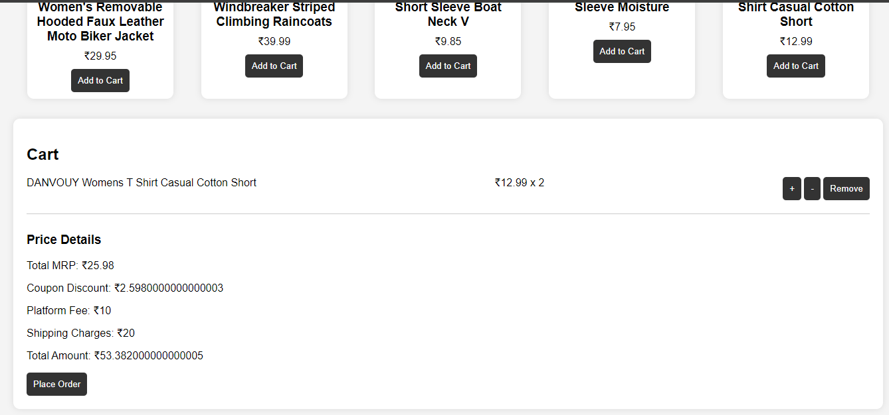

Project Title
E-Commerce Website using HTML, CSS, and JavaScript

Project Description
This project demonstrates basic e-commerce functionality by interacting with a fake API. Users can browse products, add items to the cart, remove them, and search for specific products.
1. Project Purpose
This project is a basic e-commerce website using HTML, CSS, and JavaScript. It fetches product data from the Fake Store API and allows users to:

View products
Add and remove items from a shopping cart
Increase or decrease the quantity of items in the cart
Search for specific items by name
2. Project Features
Display Products: Fetch and display products from the Fake Store API.
Add to Cart: Allow users to add products to a shopping cart.
Delete from Cart: Remove products from the cart.
Update Quantity: Adjust the number of items in the cart.
Search: Implement a search bar to filter items by name.

##Installation
1.clone Repository
`git clone https://github.com/Sri-Hasnika/E-commerce.git`
2.Install dependencies: `npm install`

##Screeshots

